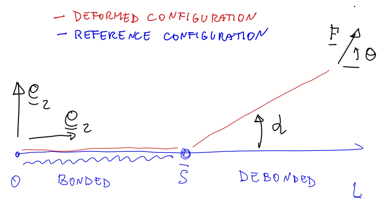

# Inextensible and perfectly flexible model

To define a material property that characterizes the ability of a tape to stick to a substrate, let's address the following problem.

Let un consider a tape of width $b$ and thickness $h$, which partially bonded to a substrate and loaded by a force 
$$\underline F = F  (\cos(\theta)\, \underline e_1 + \sin(\theta)\, \underline e_2) $$
at the free end. We set a reference frame ($O$,$\underline e_1$, $\underline e_2$) with $\underline e_1$ paralell to the the substrate, $\underline e_2$ orthogonal to the substrate, and  the origin $O$ at the interface between the bonded and debonded part. 

Let be $L$ the length of tape. Let us assume the following hypothesis
* The tape is bonded on the substrate for $s\in(0,\bar s)$
* The tape is debonded for  $s\in(\bar s,L)$
* The tape is inextensible and perfectly flexible  (do not require elastic energy to bend). Its elastic energy is vanishing.
* The equilibrium configuration of the tape is flat in the bonded  part and strainght in the debonded part. We  will denote the orientation of this straight line
$$\underline t(\alpha) =\cos \alpha\underline e_1+ \sin \alpha  \underline e_2 $$ 
* The bonding/debonding phenomenon is reversible. The bonding/debonding energy is proportional to the surface of the bonded part: 
$$D(\bar s) = G_c b \,(L-\bar s),$$
where $G_c$ is called the toughgness of the interface.

applied to the free end.

1. Show that the total energy of the system, sum of the potential energy of external force and the debonding energy is (this will be filled durint the first class)
 

$$E(\bar s, \alpha) = \ldots $$

2. Using the energy minimality principle, find the orientation $\alpha$ at the equilibrium and show that the system can be at equilibrium with $\bar s \in (0,L)$ only for a
$$ F  = \frac{G_c b}{1-\cos \theta} $$

3. Using `python-matplotlib` or `matlab` or `mathematica`, plot graphically the relation above, and the corresponding equilibrium configuration. Make the plot nice and self-explicative. 

Resume your results in a one-page intermediate report,  possible written in `latex` (or a `jupyter-notebook`). The quality of the presentation and the graphs is important.